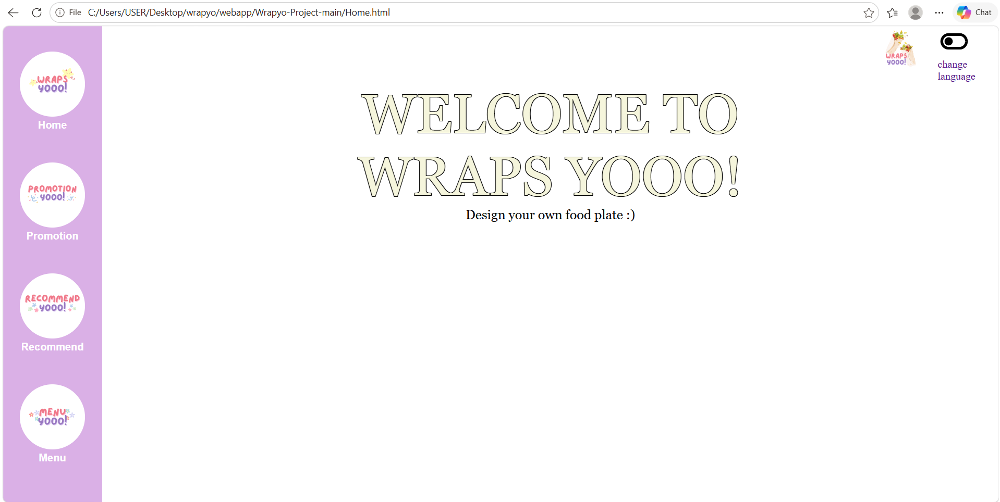
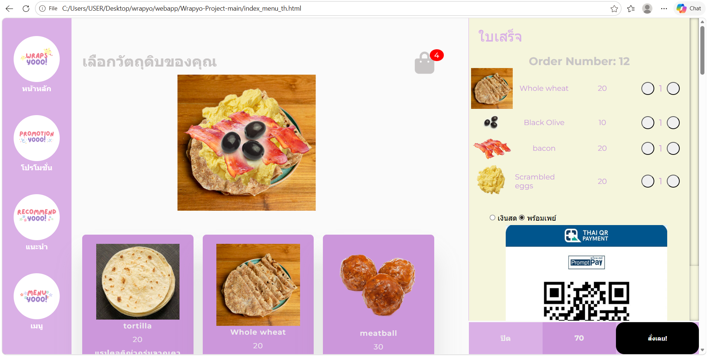
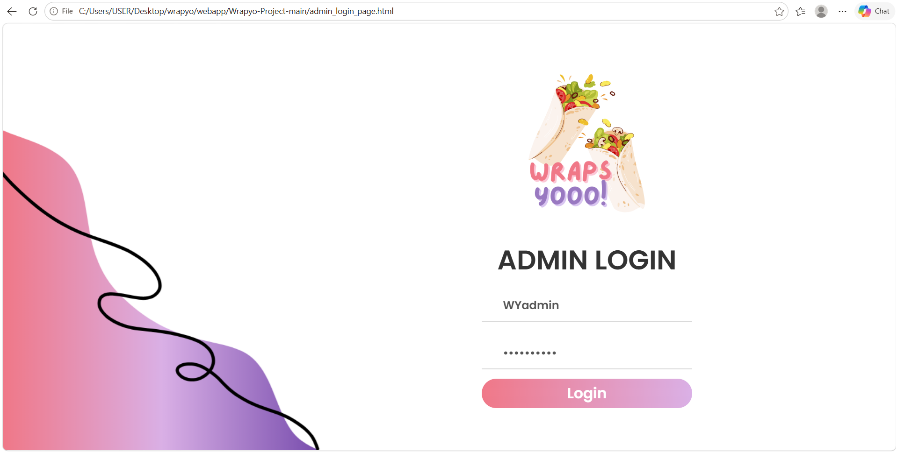
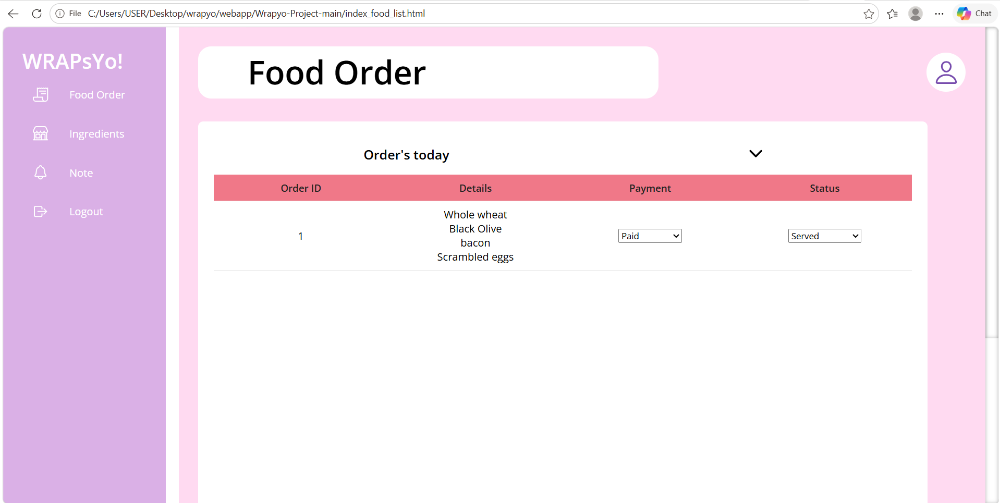
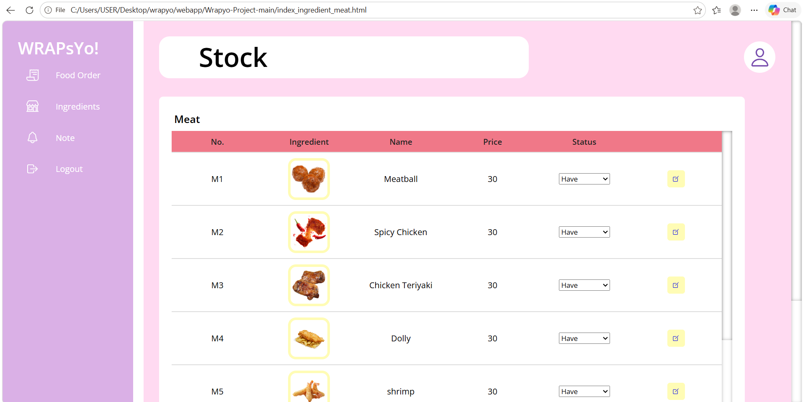

# 🌯 WrapYo Ordering Web App

**WrapYo** is a modern food ordering web application designed for both
customers and administrators. Customers can easily browse the menu,
add items to their cart, place orders, and pay via **QR Code**.
Admins can manage orders, update payment statuses, and control menu
availability — all through a clean, intuitive interface.

  
    
  
    
  
    
  
    
  

---

## ✨ Features

### 👤 Customer Side

- 📖 Browse food menu from the web interface  
- 🛒 Add items to the shopping cart  
- 📦 Place orders and pay via **QR Code Payment**  
- 🔍 Track order status in real-time  

### 🧑‍💻 Admin Side

- 📋 Manage all orders in the system  
- 💳 Toggle payment status (Paid / Pending)  
- 🔄 Update item availability (Available / Out of Stock)  
- 🍽️ Full control over the food menu  

---
